# **Lab 2: Integrating Watson Assistant with IBM Business Automation Workflow (BAW)**
In this lab we're going to show how you can extend your Watson Assistant chatbot so that it can call out external services using _**IBM Cloud Functions**_. Our assistant will be triggering a managed workflow running on _**IBM Business Automation Workflow (BAW)**_.

In practical terms, we will be setting up some service calls using IBM Cloud Functions _**actions**_ (to trigger the workflow) and then use them from our Watson Assistant skill and its _dialog nodes_.

## Requirements
- [IBM Cloud account](https://cloud.ibm.com/)
- [Previous lab](../1-Basics)

## Agenda
- Setup _**IBM Cloud Functions**_
- Setup _**Watson Assistant**_ to use _**IBM Cloud Functions**_


## Setup _**IBM Cloud Functions**_
**(1)** We need a mechanism by which we can trigger our managed workflow (running on IBM Business Automation Workflow environment) service and pass the user's inputs information to the workflow API. We'll do this by using _**IBM Cloud Functions**_ running on IBM Cloud.

Based on Apache OpenWhisk, IBM Cloud Functions is a Functions as a Service (FaaS) platform that makes it easy to build and deploy serverless applications. IBM Cloud Functions allow you to write lightweight code that executes application logic in a scalable way. You can then run this code on-demand via requests from applications like our _**Watson Assistant**_ chatbot, or automatically in response to events.

Some examples of how we might use IBM Cloud Functions from _**Watson Assistant**_ include:

- Validating information that you collect from the user.
- Doing calculations or string manipulations on user input that are too complex for supported _SpEL_ expression language methods to handle.
- Interacting with an external web service to get information. For example, you might check on the expected arrival time for a flight from an air traffic service.
- Sending requests to an external application, such as a restaurant reservation site, to complete a simple transaction on the user's behalf.

**(2)** Within your IBM Cloud account, go to _**IBM Cloud Functions**_ by selecting the `burger icon` in the top left-hand corner, then `Functions`.

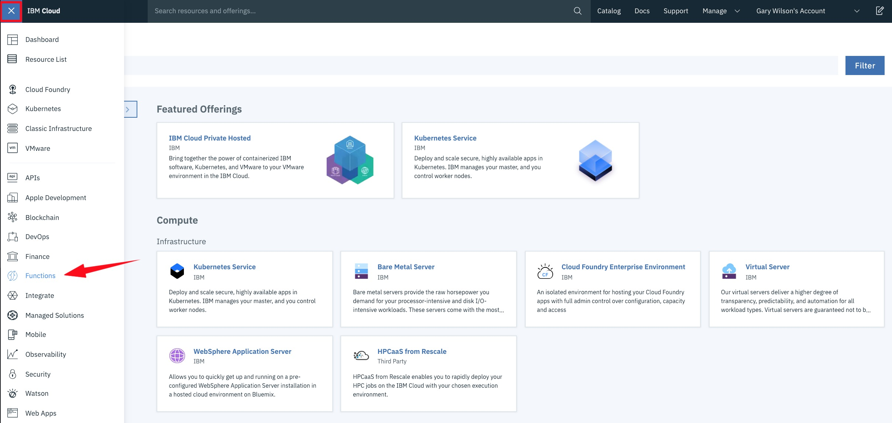

From there, first _**check the pulldown menu at the top right**_.

**!!Make sure the selected location is the same region where you created your Watson Assistant service!!** So, if you used _London_ for your Watson Assistant, you should select _London_ also for your IBM Cloud Functions.

Next, click `Start Creating`, then `Create Action`.

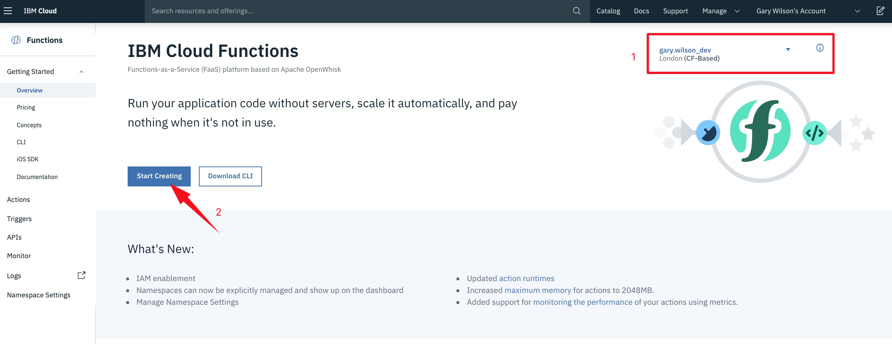


**(3)** Call your new action `Get Workflow Token` then ensure you select a `Runtime` of **Node.js**, and hit `Create`.

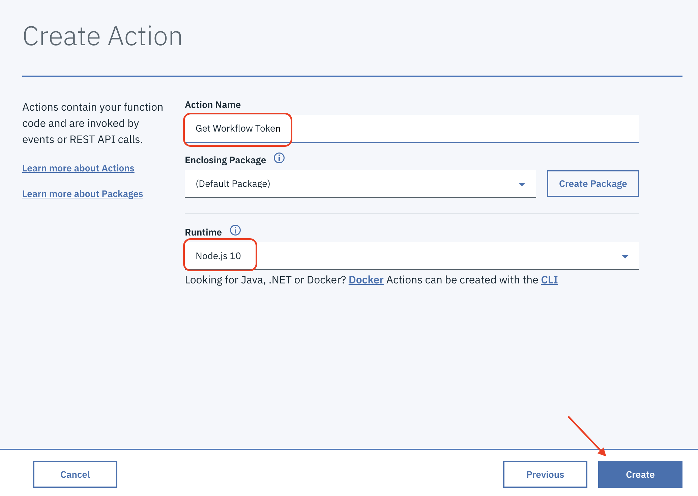

You'll then be transported to a code editor. Delete all of the default lines of code within the editor, and replace them with these:

```Javascript
/**
  *
  * main() will be run when you invoke this action
  *
  * @param Cloud Functions actions accept a single parameter, which must be a JSON object.
  *
  * @return The output of this action, which must be a JSON object.
  *
  * The port is unique to every environment
  *
  */

const needle = require('needle');

async function main(params) {

var headers = {
    'Content-Type': 'application/json',
    'Host': 'api.eu-gb.apiconnect.appdomain.cloud'
};

var data = '{"refresh_groups": true,"requested_lifetime": 7200}';

var options = {
    method: 'POST',
    headers: headers,
    body: data
};

// Make sure you replace XXXX with your port number
var URL = 'https://api.eu-gb.apiconnect.appdomain.cloud/jkj-org-dev/sb/awib-workflow/login?port=XXXXX';

  try {

    let response = await needle(URL,headers,options);
    var token = response.body.csrf_token;
    var call_result = {
        "token": token,
        "status": "Success"
    }
    return {token: token, status: "Success"};

  } catch (err) {
    console.log(err)
    return Promise.reject({
      statusCode: 500,
      headers: { 'Content-Type': 'application/json' },
      body: { message: err.message, status: "Failed" },
    });
    console.log("error test");
  }
}
exports.main = main;
```

This code will call the managed workflow (running on IBM Business Automation Workflow environment) API and get the authentication token.

**(4)** You only need to make a small change to this code.

- Replace `port=XXXXX` with the value of your environment port, given by your instructor. **Note that your port number might be 4 or 5 numbers long!**.

Now hit `Save`.

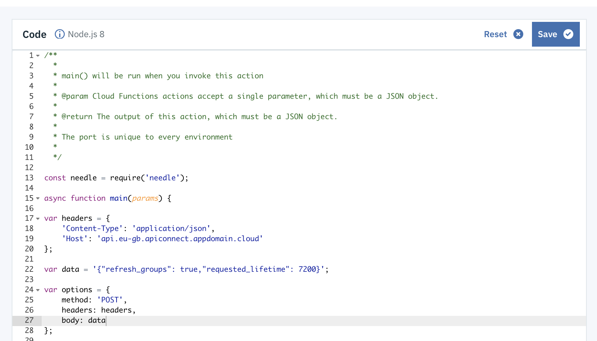

Select `Endpoints` from the sidebar, tick the `Enable as Web Action` box, then `Save`.

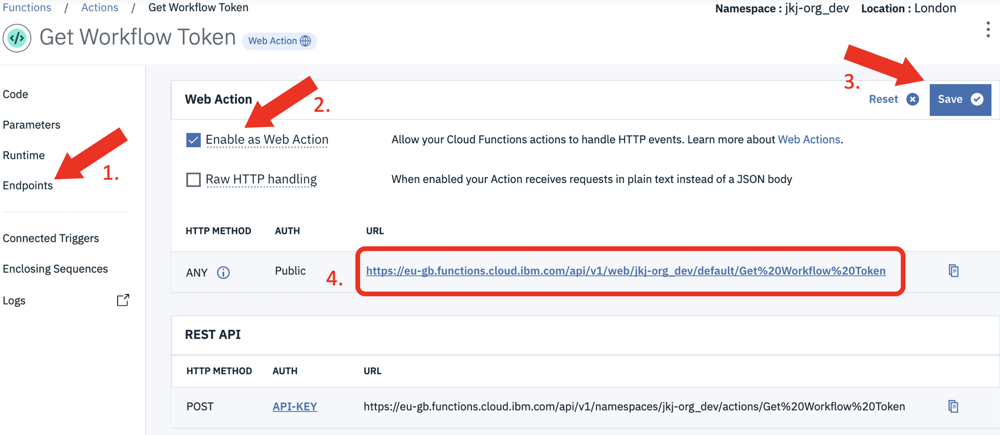

**Copy the Web Action URL and save it in a notepad, you will need it later**. It should look something like this:

https://eu-gb.functions.cloud.ibm.com/api/v1/web/jkj-org_dev/default/Get%20Workflow%20Token

**(5)** Now let's create another action. Click on the Actions menu on the top left side of the screen:

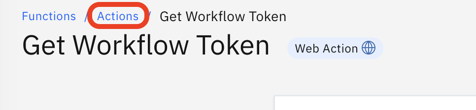

Then repeat the previous process. Create (click "Create" button) new action called: **Start Address Change Workflow** and paste in the following code:

```Javascript
/**
  *
  * main() will be run when you invoke this action
  *
  * @param Cloud Functions actions accept a single parameter, which must be a JSON object.
  *
  * @return The output of this action, which must be a JSON object.
  *
  */

const needle = require('needle');

async function main(params) {

var headers = {
    'Content-Type': 'application/json',
    'BPMCSRFToken': params.token,
    'Host': 'api.eu-gb.apiconnect.appdomain.cloud'
};


var payload = {
    input:[
      {
        name: 'data',
        data: {
          name: params.name,
          business_id: params.business_id,
          street_address: params.street_address,
          postcode: params.postcode,
          city: params.city,
          email: params.email
        }
      },
    ]
  };

var options = {
    method: 'POST',
    headers: headers,
};

//Replace the XXXX with your port number
var URL = 'https://api.eu-gb.apiconnect.appdomain.cloud/jkj-org-dev/sb/awib-workflow/process?model=Handle%20data%20change&container=AWIBWOR&port=XXXXX';

  try {
   let response = await needle(URL,JSON.stringify(payload),options);
    var success = response.body;
    console.log(response.body);
    return {success};

  } catch (err) {
    console.log(err)
    return Promise.reject({
      statusCode: 500,
      headers: { 'Content-Type': 'application/json' },
      body: { message: err.message },
    });
    console.log("error test");
  }
}
exports.main = main;

```

This code will use the authentication token from the previous action and call the BAW with the data we enter in the Watson Assistant chatbot.

**(6)** Again, you only need to make a small change to this code.

- Replace `port=XXXXX` with the value of your environment port given by your instructor and note that your port number might be 4 or 5 numbers long.

Now hit `Save`.

Select `Endpoints` from the sidebar, tick the `Enable as Web Action` box, then `Save`.

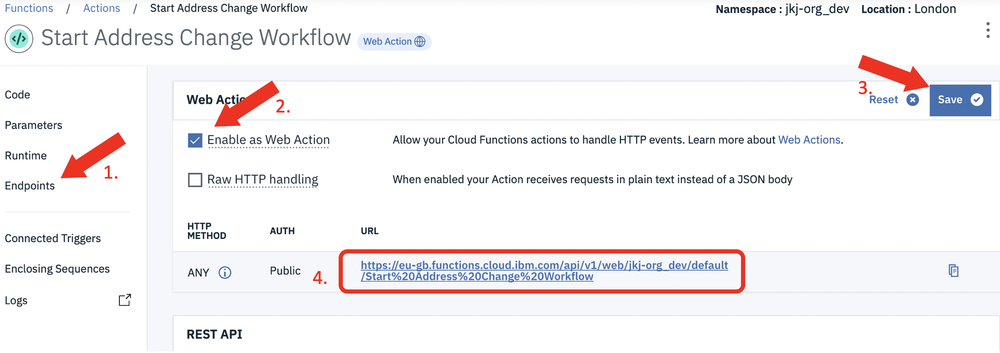

Copy the Web Action URL and save it in a notepad, you will need it later. It should look something like this:

https://eu-gb.functions.cloud.ibm.com/api/v1/web/jkj-org_dev/default/Start%20Address%20Change%20Workflow


**(7)** We've now successfully created two IBM Cloud Functions *actions* to "talk" to our IBM Business Automation Workflow API and to launch the *Handle Address Change* workflow. The final thing we need to do here is to make the actions callable from our _**Watson Assistant**_ (or in fact, any other application).

Now let's go and use our functions in _**Watson Assistant**_.

If you are still in Actions, click **Functions** to get to your main Functions page.

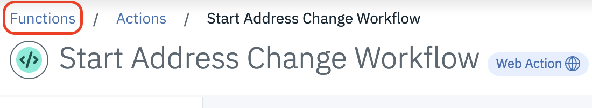

## Setup _**Watson Assistant**_ to use _**IBM Cloud Functions**_
As you've already seen, you need to pass security credentials between services and applications in order to use them. In order to call _**IBM Cloud Functions**_ from within _**Watson Assistant**_ _dialogs_ we need to understand their credentials and encode them correctly.

**(1)** Get your _**IBM Cloud Function**_ **API Key** from the `Namespace Settings` option in the left side meny. There's a copy icon available to copy the key to the clipboard.

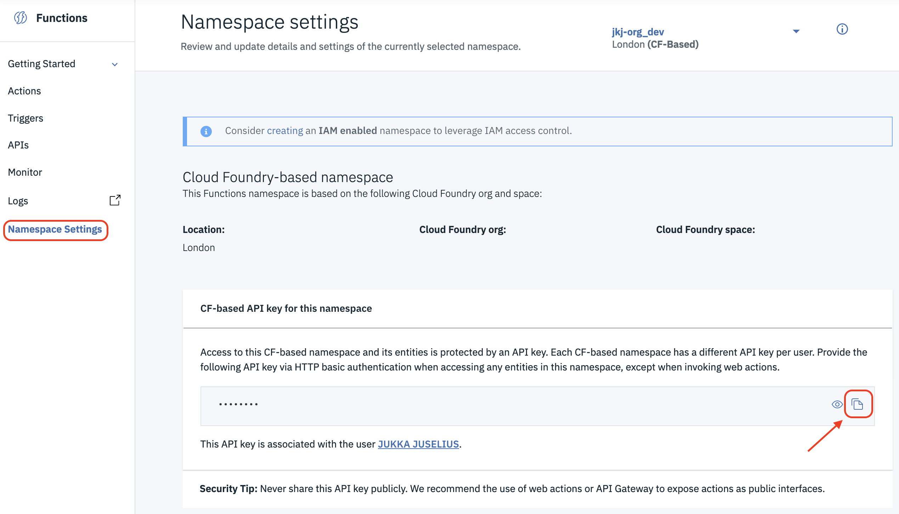

**(2)** In your _**Watson Assistant**_ _skill_, you will see a node called `Welcome`. Click it to open its configuration.

Under the 'Then set context' there is a variable called `$private` with the value below:
```Javascript
{"myCredentials":{"api_key":"<your-ibm-cloud-functions-api-key>"}}

```

Replace `<your-ibm-cloud-functions-api-key>` with the key you copied earlier in step **(1)**.

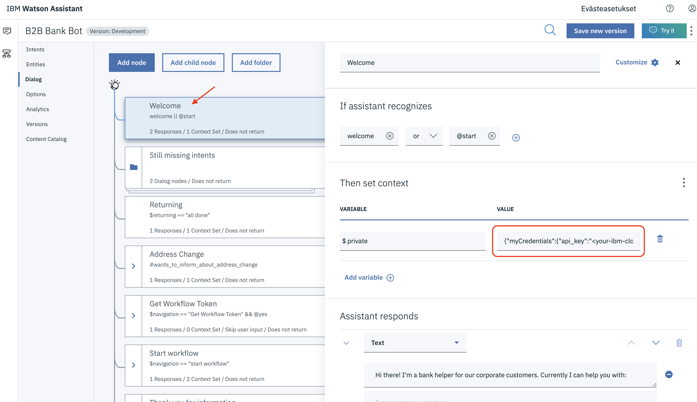

Your value for the $private variable should look something like:
**{"myCredentials":{"api_key":"16fcbbb5-8124-435f-8326-38a213704870:i3ejktRgIPu2svXXXXXXXXXXXXXXXXXXXXXXXXXXXXXXXX"}}**

**NOTE!!** Make sure to remove also the "<" and ">" signs from the template. So that you API key is just surrounded by quotation marks.

Now regardless of integration type our chatbot will always start correctly, and it will define the credentials required to call any of our _**IBM Cloud Functions**_.


**(3)** Find the node called _**Get Workflow Token**_ and click to open its configuration.

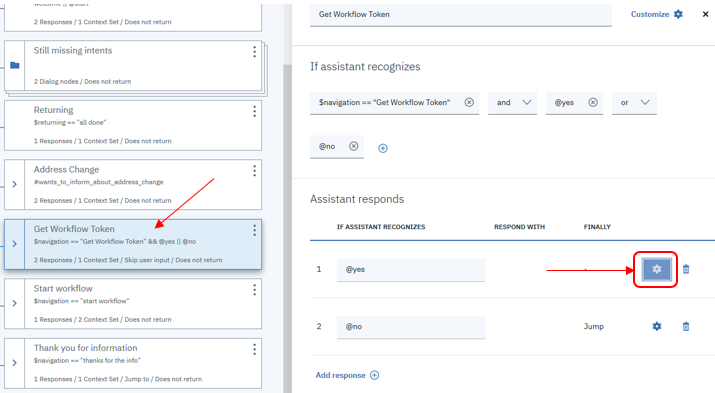

Click the `gear symbol` from the first "Assistant responds" row to open the response editor.

The **only** thing you will need to replace here is `<your-get-workflow-token-endpoint>` with the endpoint information you copied for your Get Workflow Token action. If you didn't save the endpoint in you can get the name of your _**endpoint**_ by going back to your _**IBM Cloud Function**_ in IBM Cloud, clicking `Endpoints` from the sidebar (if you're not already on that screen), then copying everything in the **Web Action URL** _after_ _**.../web/**_.

**NOTE!**
Just use the part of the URL **AFTER** the **.../web/*** !!!

It should look something like:

`name.lastname_dev/default/Get%20Workflow%20Token.json`

**NOTE2!**
If your endpoint URL is missing ".json" from the end, **you need to add it!!** Also make sure to remove the "<" and ">" signs from the template.

After copying your end point to the configuration it should look similar to this:

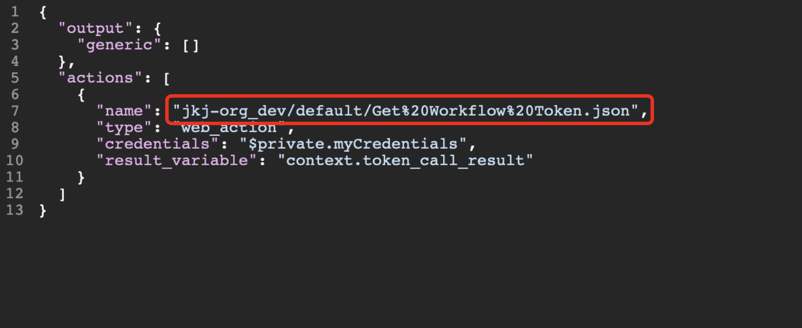


**(4)** Find the node called _**Email given**_ (child node of Start workflow and Email notification) and click it to open its configuration.

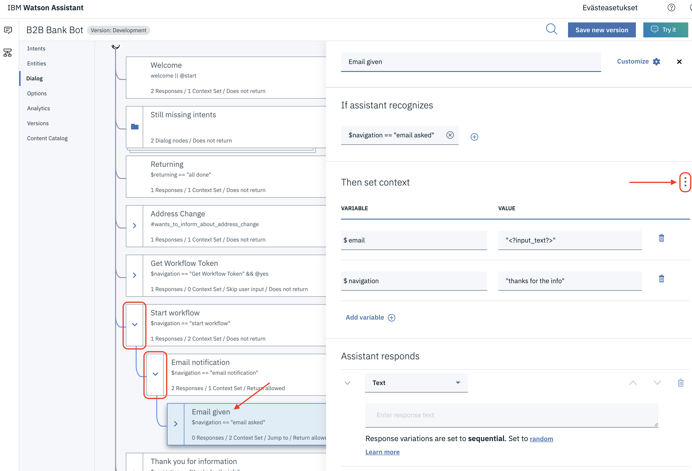

Click "the 3 dots menu" to open JSON editor and replace `<your-start-address-change-workflow-endpoint>` with the endpoint information you copied for your Start Address Change Workflow action. This is where we trigger the managed workflow that will later start the RPA process. It should look something like:

`name.lastname_dev/default/Start%20Address%20Change%20Workflow.json`

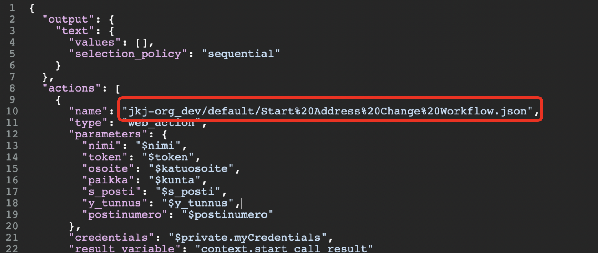

**NOTE!**
Just use the part **AFTER** the **.../web/*** !!!

**NOTE2!**
If your endpoint URL is missing ".json" from the end, **you need to add it!!** Also make sure to remove the "<" and ">" signs from the template.

Finally click "the 3 dots menu" again and select "Close JSON Editor" to save your changes.

Fantastic! Continue with lab 3 to get started with the IBM Business Automation Workflow (BAW) and the Robotic Process Automation (RPA) part. Once you have the next labs running you will be able to call your managed workflow from your Watson Assistant chatbot!


## Summary
You've reached the end of this lab! By completing it you've learned how to further enhance your chatbot by calling external services using _**IBM Cloud Functions**_.

Once you have completed the next two labs you will be able to connect with the BAW using your chatbot.
The chatbot will gather the information needed (Company name, company business id, street address, city, postcode) and send them to the BAW to be checked and handled.

This is what the conversation will look like:

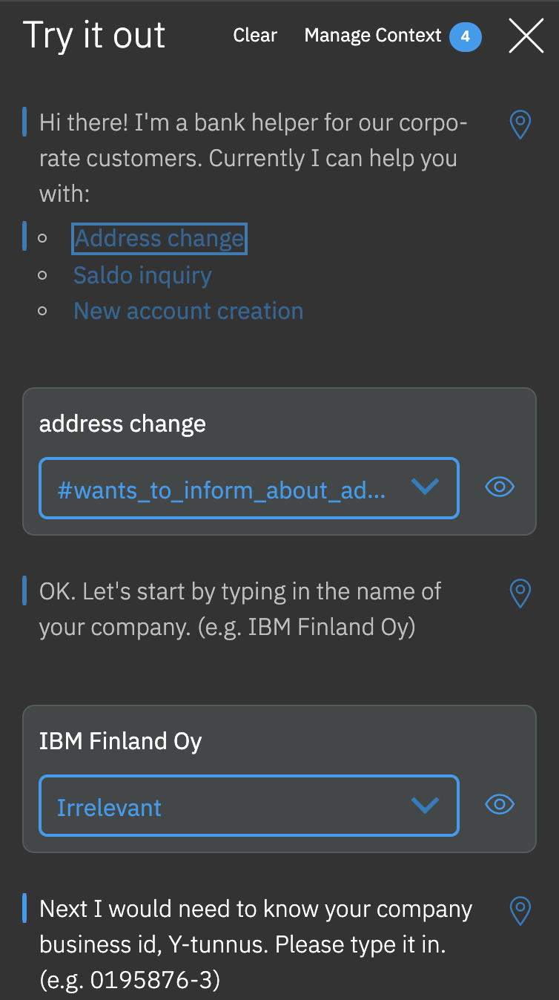

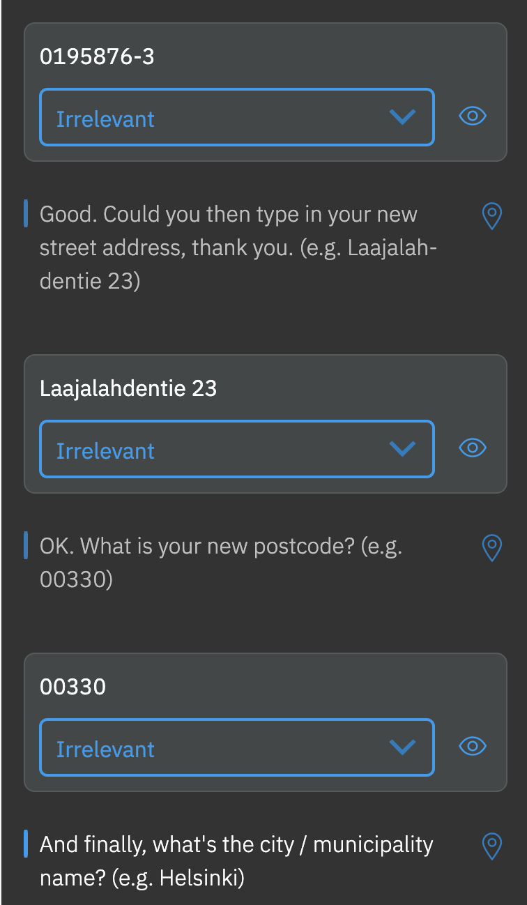

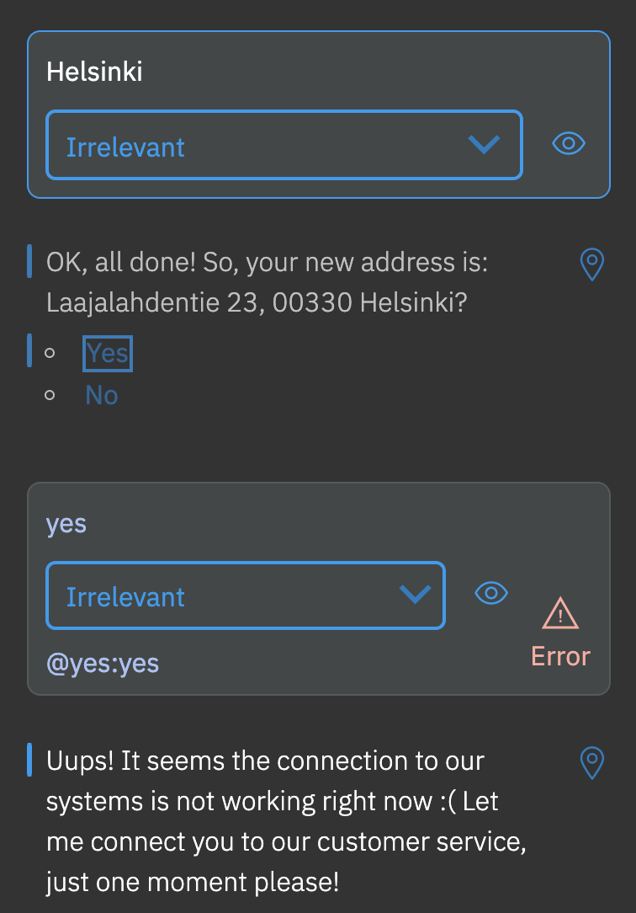


The error at the end is due to the fact that you do not have your workflow environment yet running that your chatbot tries to call. Don't worry, we'll fix this in the next labs!
