## ALL DONE?

Not quite! Now it's time to test all the components together! Btw, **CONGRATS** making this far!

Now it's time to pull all the things together and test our solution end-to-end. Before running the solution, we need to test that the connection from your IBM Cloud Functions to BAW virtual environment is working and you your Virtual Assistant configurations are correct.

## Test your IBM Cloud Functions connection to BAW

**1.** Open your IBM Cloud Functions view from your IBM Cloud account.

Navigate to **_actions_**, open **Get Workflow Token** and in the code view, click the **Invoke** button from the right upper corner.

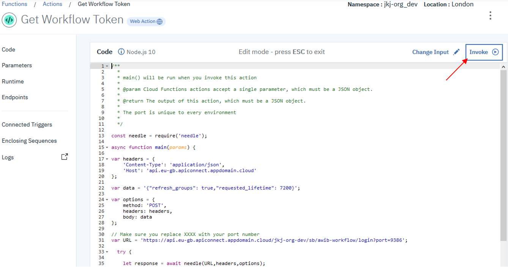

**2.** If everything is working as expected, you should see a successful activation.

**Note!** When you run your action for the first time, it might take serveral seconds (even over 10 secs) to complete. So, be patient.

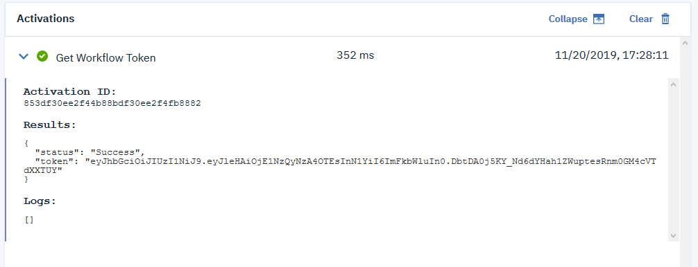

If you do not see a message about successful activation / you see an error massage, something is wrong and you need to troubleshoot. Otherwise you can move forward to next step.

> Troubleshooting

Check these first:

- Your virtual BAW environment is running (you can access the environment as you did in lab 3 and 4).
- The **port number** you are using in your IBM Cloud Functions _action_ matches with the one you got from your instructor (Lab 2, Setup IBM Cloud Functions: **Step 4**).
- The **code** for your action is exactly as in the instructions (Lab 2, Setup IBM Cloud Functions: **Step 3**).

When you have made the checks and found nothing to correct or after corrections you are still not able to run a successful invocation, please ask help from your instructor.

## Open your BAW web designer INSPECTOR view and make sure you do not have any previous workflow instances running

In order to verify that your Watson Assistant can indeed start a new _**Handle data change**_ workflow instance, you need to open your BAW web designer and its **INSPECTOR** view.

**1.** Open _Handle data change_ process as you did in lab 3, if not already open.

- Open Chrome browser within your virtual desktop and navigate to **Workflow Center - Solutions**.
- Open **Process Apps** and then **AWiB-workflow**.
- Finally open **Handle data change** from the left-hand side navigation bar under _Processes_.

**2.** Switch to _**INSPECTOR**_ view by clicking the "INSPECTOR" text on the top bar.

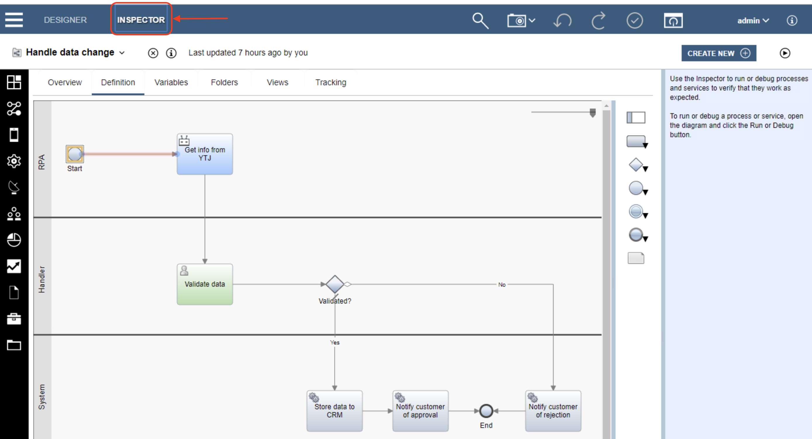

**3.** Next open the instance search view by clicking the "magnifying glass" icon on the top bar.

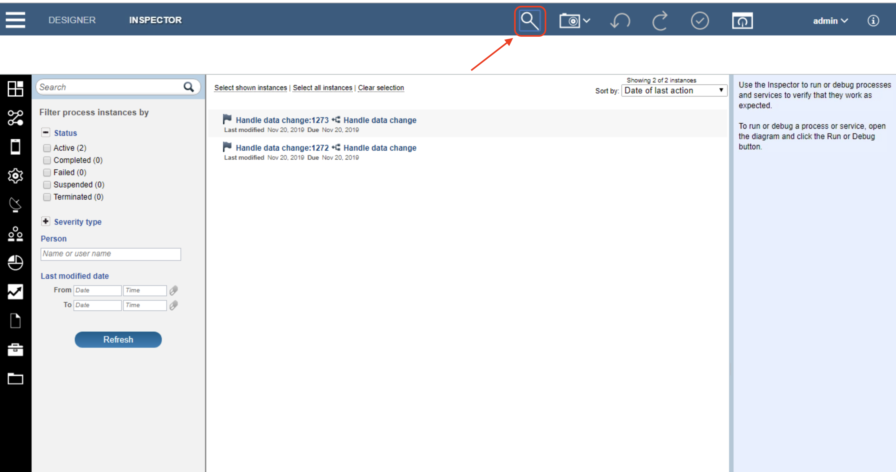

**You should NOT have any instances in your environment as the case is with the picture shown above**. If you have accidentally started the workflow during the earlier labs, you might have have similar situation as shown in the picture. If so, follow the below instructions to remove the instances, otherwise you can move to the next section of this lab. **Leave the INSPECTOR / Search View open**.

> How to remove the instances

1. Click the instance to select it and you see the instance information appearing to right-hand side.

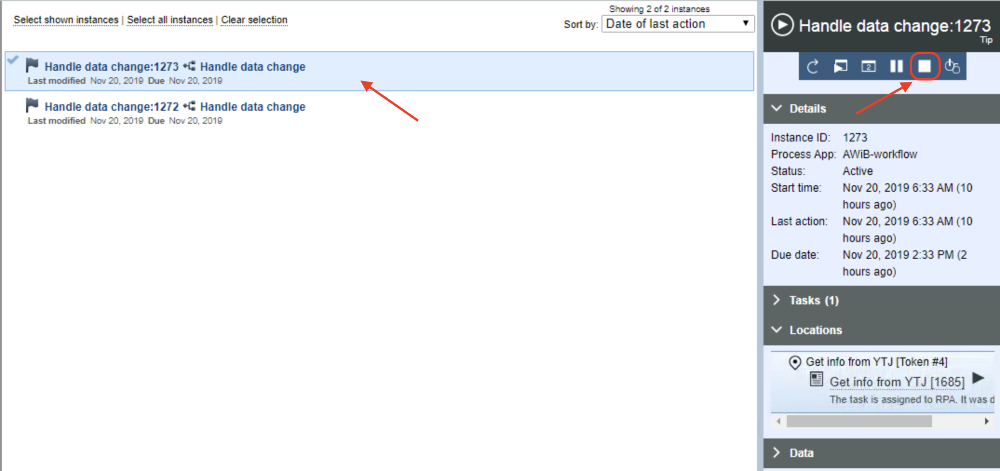

2. Click "the Terminate" (if the instance is active) or/and "the Delete" control (if/when the instance is terminated or completed) to clear out the instance from the list. Accept the termination / deletion when asked.
3. Repeat for all the instances in the search result list.
4. Finally click "the Refesh" button to verify that all the instances are deleted and your search result list is clear. **Leave the INSPECTOR / Search View open**.

## Use your Watson Assistant to trigger the workflow

We can run through our Watson Assistant **dialog** and test, if we can trigger a new workflow instance.

**1.** Open your Watson Assistant service and your B2B Bank Bot _**skill**_ - that we imported in Lab 1 and extended in Lab 2 - from IBM Cloud (if not already open).

**2.** Click "**Try it**" button on the top right-hand side to test your skill and its dialog.

**3.** When "the Try it out" section opens to the right of your browser window, run through the dialog with the following selections / input:

- Select **Address change**
- Type in something (does not really matter what) for the _**company name**_.
- Type in something (does not really matter what) for the _**business id**_.
- Type in something (does not really matter what) for the _**street address**_.
- Type in something (does not really matter what) for the _**postcode**_.
- Type in something (does not really matter what) for the _**city**_.
- Click **Yes** when the dialog shows the collected information and asks if it's correct.

   *NOTE! If you see an error here, then your Get Workflow Token dialog node is not configured correctly. See "Troubleshooting Get Workflow Token node" below*.
- Click **No thanks** when the dialog asks if you want an email confirmation.

> Troubleshooting Get Workflow Token

- If you see an error after accepting the gathered address information when your run through your Watson Assistant dialog, it's most probably caused by a misconfiguration of the *Get Workflow Token* dialog node in your B2B Bank Bot skill.
- Please revisit the **Lab 2** where you added your IBM Cloud Functions web action URL to the node and make sure that you have configured your node exactly as instructed (Lab2, Setup Watson Assistant to use IBM Cloud Functions: Step 3).

**4.** Move back to your **INSPECTOR view** in your virtual environment and hit the **Refresh** button.

``If you have configured everything correctly, you should now see a new active instance in your search results list!``

**Click** the instance to select it and bring up the instance information panel to the right-hand side of the view. You can then expand the **Data** section and the **data(Customerdata)** object to see the data that your Watson Assistant collected via its dialog and sent to your BAW workflow. Nice!

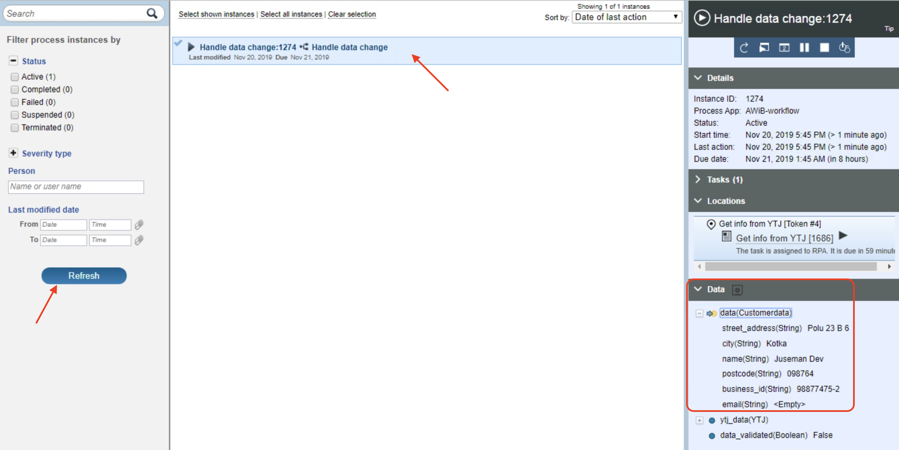

``If you do not see a new instance appearing in 15 seconds and after hitting the **Refresh** button again (when you trigger the workflow for the fist time it might take some time before the instance appears), then your configuration has some errors and you need to troubleshoot.``

If you DO see the instance, **remove it from the list** by first _terminating_ it from the instance information panel controls and then _deleting_ it (if needed, look at the instructions above under "_Open your BAW web designer INSPECTOR view and make sure you do not have any previous workflow instances running: How to remove the instances_"). When done, you can move on to the final test!

> Troubleshooting

- The most obvious reason for your end-to-end solution not working at this stage is that you have an error in your Watson Assistant / IBM Cloud Functions _actions_ configuration.
- Check your **Start Address Change Workflow** IBM Cloud Functions _action_ and make sure that the **port number** you are using in your code matches with the one given by your instructor and the code itself is exactly as in the instructions (Lab 2, Setup IBM Cloud Functions: **Step 5**).
- Check your Watson Assistant _dialog node_ **Email given** for any typos for the web action configuration (Lab 2, Setup Watson Assistant to use IBM Cloud Functions: **Step 4**).
- If you can not find the cause for the error, ask help from your instructor!

## Final test with RPA included

**Now you are really close to finishing the exercise!** What we will do next is to repeat the last step (triggering the workflow with Watson Assistant) with our RPA also running.

**1.** Within your virtual environment access / open your RPA client (if not already open). You should open the **main** client window, not the **editor/workbench** window that you used to develop the _YTJ implementation bot_. In fact, if you still have **the editor** window open, please close it.

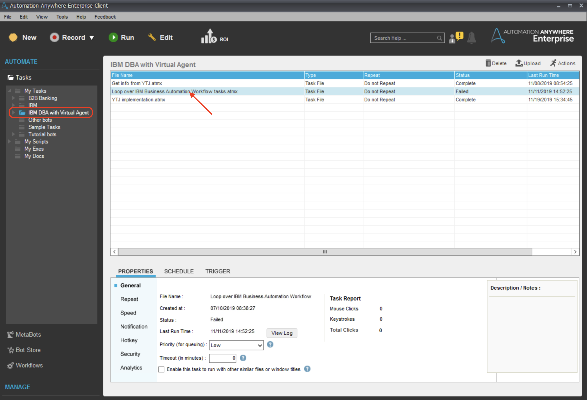

**2.** Open the _**IBM DBA with Virtual Agent**_ folder and start the **Loop over IBM Business Automation Workflow tasks.atmx** task bot by _double clicking it_. Alternatively you can click it once to select it and then hit the **Run** icon from the top control bar.

When you run the task bot, you should see a small "Run Time Window" appearing to your screens right-hand side bottom corner. This indicates that the *Loop over... bot* has started. The bot should proceed to line **26 of 41** and then halt.

What is actually happening "under the hood" is that the bot made a connection to your BAW platform and checked if there are some **Handle data change** workflow instances started that wait for RPA to action (the first activity in the workflow: *Get info from YTJ*). Since you should not have any, the bot halts for a while and then checks the situation again after some time.

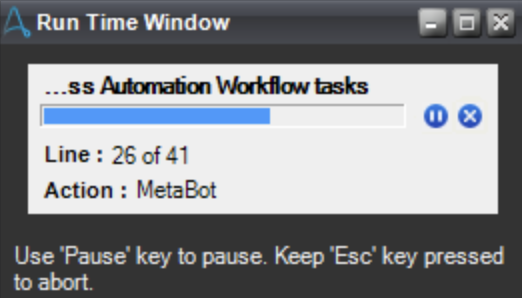

Good! Now we have our RPA ready to action, when we trigger a new workflow instance from our Watson Assistant. _**Make sure to leave the small RPA Run Time Window open!**_

**3.** Run through your Watson Assistant B2B Bank Bot dialog as you already earlier did, **BUT** this time use some real values:

- Select **Address change**
- Type in **IBM Finland** for the _**company name**_.
- Type in **0195876-3** for the _**business id**_.
- Type in **Laajalahdentie 23** for the _**street address**_.
- Type in **00330** for the _**postcode**_.
- Type in **Helsinki** for the _**city**_.
- Click **Yes** when the dialog shows the collected information and asks if it's correct.
- Click **No thanks** when the dialog asks if you want an email confirmation.

After running through the dialog, you should see this response:

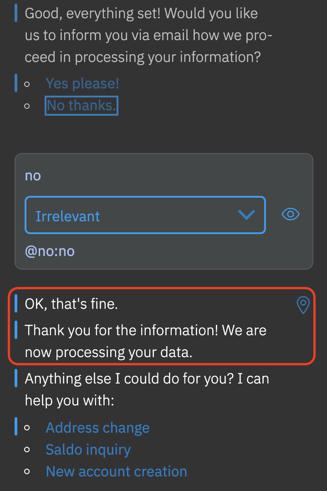

Nice! You should have successfully triggered a new *Handle data change* workflow instance and your RPA should be soon activated, when the *Loop over...* bot checks the situation again.

**4. Switch back to view your virtual environment** and wait for RPA to activate.

NOTE! Hands off! You do not want to mess with your RPA when it's running something in your desktop! When the RPA is activated. You should see the bot you implemented - **YTJ implementation** - running and gathering the official address data for the company you defined for your Watson Assistant, IBM Finland.

Did you see your YTJ implementation bot running? It might take a minute or two before the RPA is activated. This depends on the cycle how the *Loop over...* bot is checking if there are open tasks for RPA.

``If you do not see your YTJ implementation bot running after 2 minutes, there might be something wrong with your environment. Ask your instructor for help.``

**5.** Inspect the status of your workflow instance and run the next task using the inspector view.

After your YTJ implementation bot has executed the *Loop over...* bot automatically notifies our *Handle data change* workflow instance that the first activity of the workflow (Robot Task *Get info from YTJ*) is now completed. This might take a while, but when you see your RPA **Run Time Window** again halting to line **26 of 41**, the operation should be fully completed.

Switch to workflow **web designer** to it's **INSPECTOR search** view if not already open. Click the **Refresh** button and you should see an active workflow instance in the search results list.

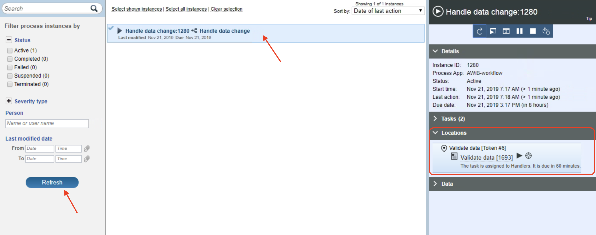

**Click** the instance to select it and bring up the *instance information panel* to the right of your screen. We can now see, under *Locations section* that your workflow has moved to the second activity, **Validate data**.

Click the **magnifying glass** icon on top navigation bar. The search view should close and you should see your workflow definition as shown in the picture below. Notice that you are still in **INSPECTOR** and you can see the workflow activity to which our workflow has now proceeded to, i.e. Validate data.

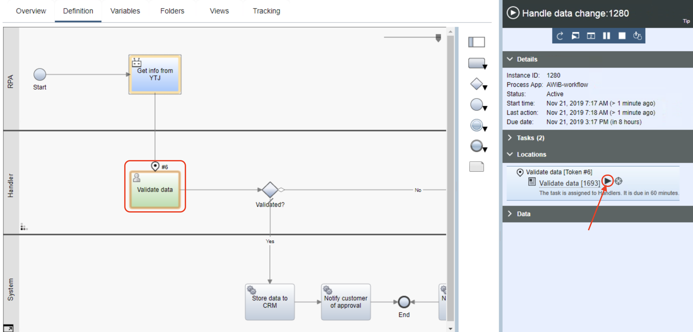

**Click** the "Run" icon from the instance information panel to run the *Validate data* activity. Since this is activity is implemented as a *Human Task*, the UI designed for it will open in the new window.

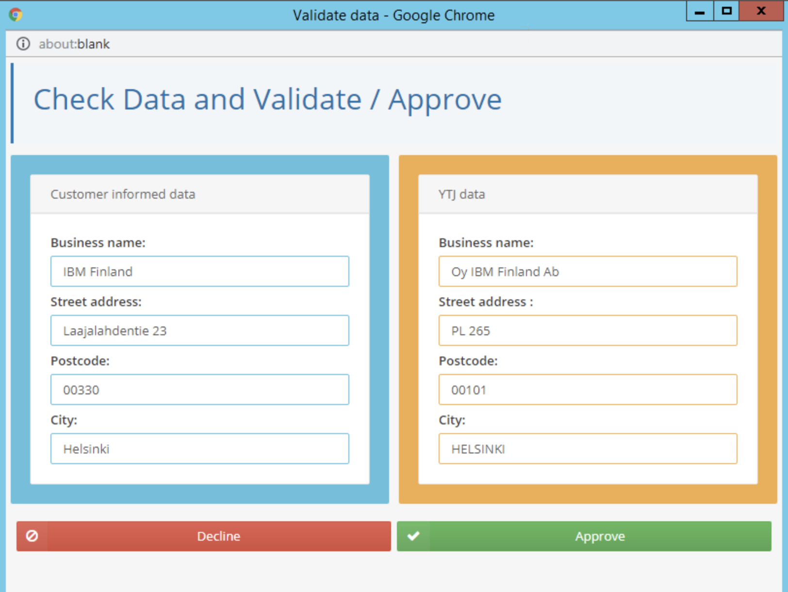

Now our handler, responsible to make sure that the customer informed data is valid, can see both the data provided by the customer via your Watson Assistant (*Customer informed data*) AND the data that your RPA bot gathered from YTJ site (*YTJ data*). What do you think? Should the handler decline or approve?

I think we should **decline** since the street address and the post code are not the same. It happens that you used IBM Finland's visiting address when you answered the questions of your *Virtual Assistant*, not the official post address that RPA gathered from YTJ site.

Click the **Decline** button and when you see "The service has finished" text, you can close the window.

Back in the **INSPECTOR** you should see that the workflow instance has now **completed**. From the instance information panel, under the **Tasks** section, you can see all the tasks/activities that were conducted when running through the workflow.

Since you declined the data change, you can see that after *Validata data* step the workflow proceeded to *Notify customer of rejection*. Obviously, should you have accepted, the workflow would have chosen another path, first storing the address data to CRM and then notifying the customer of approval. Makes sense?

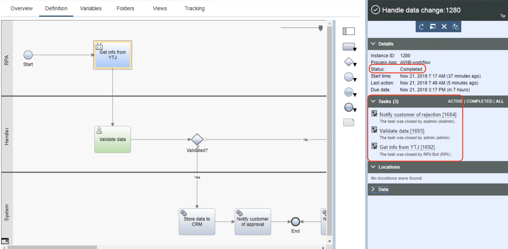

# CONGRATULATIONS!!

You made it! You just ran through the hole end-to-end solution! Great stuff! Finally, we want to mention a couple of things.

> As you noticed, we tested the solution using the integrated testing capabilities of the Watson Assistant, IBM Cloud Functions, IBM Business Automation Workflow and IBM RPA platform. Obviously, in real life we would deploy/integrate our Watson assistant to a web site or to our channel application, workflow participants (here our handler checking the address data) would be notified of their waiting tasks and they would access them using a workflow portal or with more integrated manner from their corporate workspaces and finally the RPA bots would be running somewhere (virtual servers on premises or in cloud) executing their tasks without any direct supervision as part of managed workflows.

> The exercise is build around oversimplified use case and the purpose of course is not to build up a production ready automation solution. Also all the implementations are quite simple and lack the finesse that we would use for real production ready solutions. Idea here, of course, was to show you how we can start utilizing and combining different capabilities together to provide end-to-end AI assisted automation solutions.

Hope you enjoyed doing the labs! Cheers!

[Learn more about IBM Automation](https://www.ibm.com/automation)
