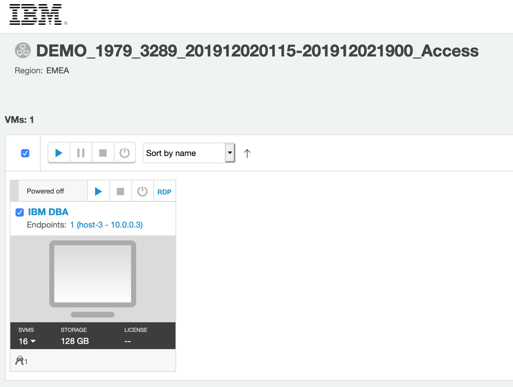
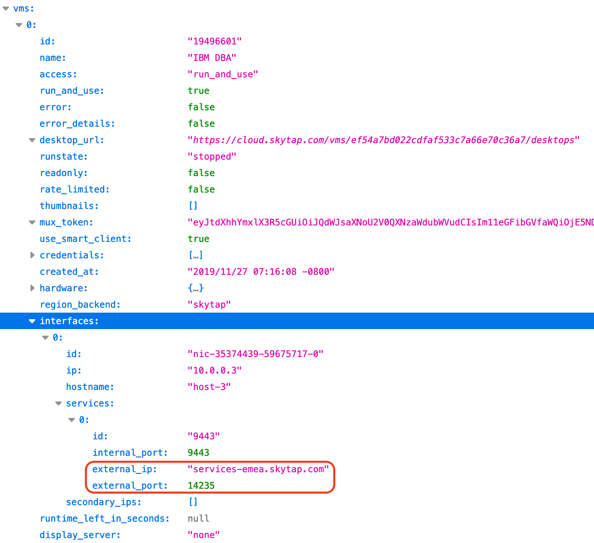
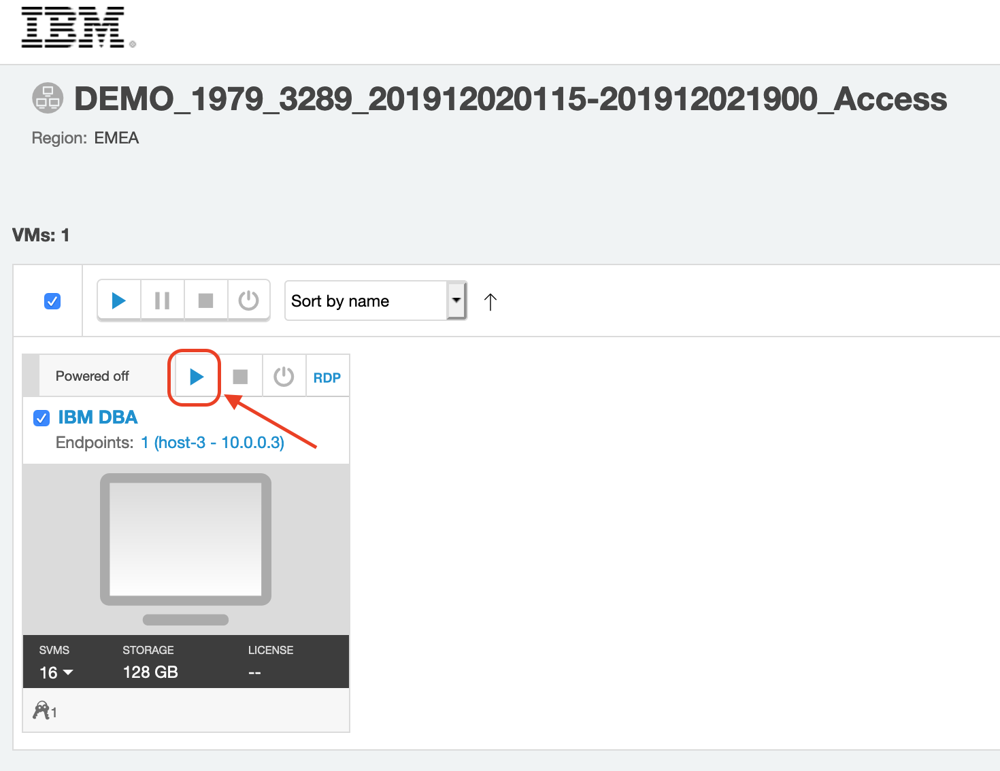
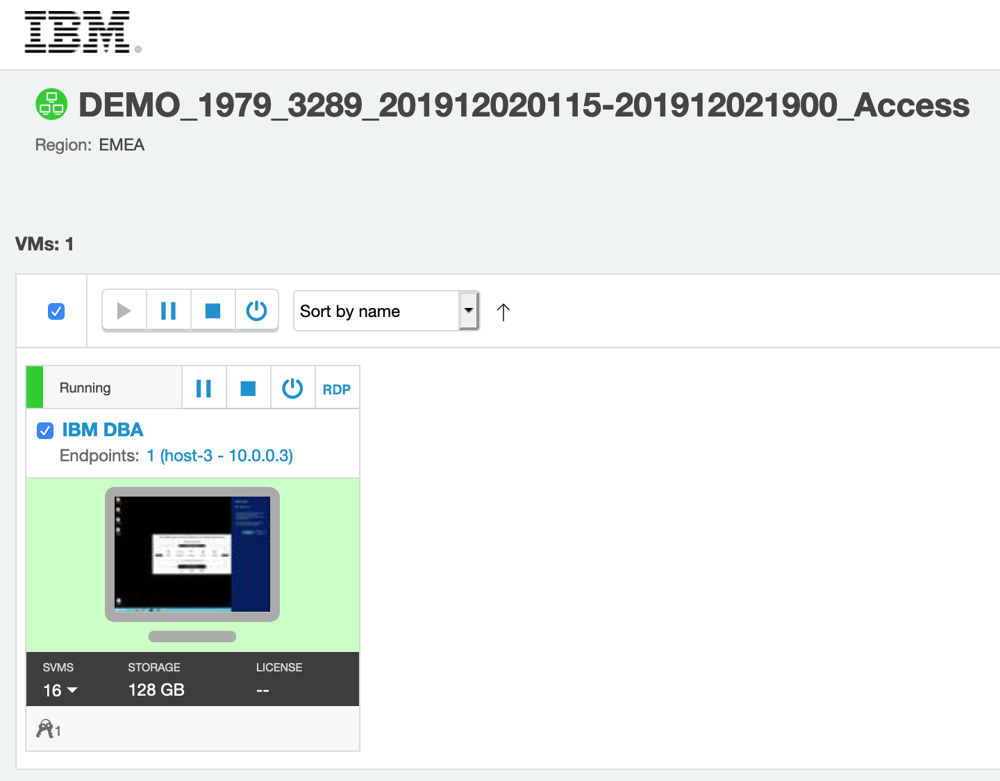
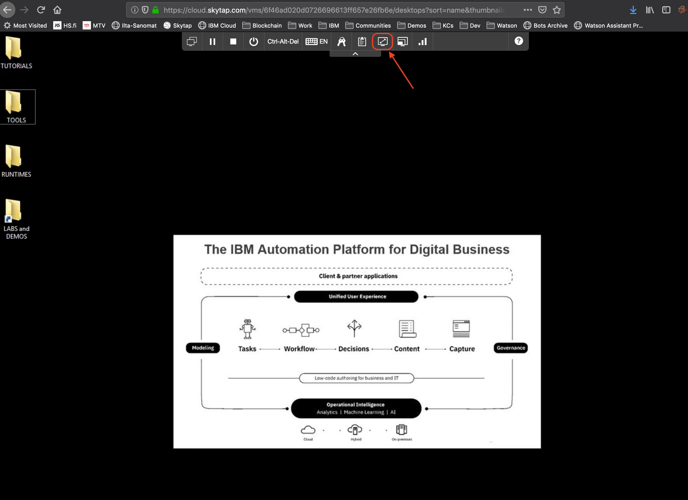

# **Lab 0: Setting Up Your Environment**
If you have provisioned your virtual environment from [IBM Blue Demos site](https://bluedemos.com/show/3238) by reserving a demo instance, you need to
1. _**find out the published service URL for your environment**_ (you need this in Lab 2) and
2. _**start your environment and BAW and RPA services**_ before you proceed to Lab 3.

## 1. Finding out your environments published service URL
In order to trigger a managed workflow - and subsequently a RPA bot - from our Watson assistant service / IBM Cloud Functions actions, we need to know the URL and the port to use.

When you reserved your environment from Blue Demos, you received an email with a link to and password to your environment. The link should look something like this: _https://cloud.skytap.com/vms/ef54a7bd022cdfaf5XXXXXXXXXXXXXXXX/desktops_

**1)** Click the link and use the password provided to login and to bring up your environment portal.

**2)** Now, when logged in to your environment portal, copy the original link to your environment from the email, add _**".json"**_ postfix to the end of the URL and use that to bring up the JSON definition file of your environment in your browser. The link to use should look something like this: _https://cloud.skytap.com/vms/ef54a7bd022cdfaf5XXXXXXXXXXXXXXXX/desktops.json_

**3)** Find your _**external_ip**_ and _**external_port**_ definition as shown in the picture below (vms:0:interfaces:0:services:0). You need both of these values in Lab 2, so make sure to write them down.

## 2. Start your virtual environment
Navigate back to your environment portal (you can close the JSON definition) and start your environment by clicking the **"Play" icon** as shown in the picture below.

After clicking the play icon, your environment should start booting up. This will take a minute or two and at this stage you can start working with the [Lab 1](../1-Basics) and after finishing it come back to check the status of your virtual environment.

## 2. Access your environment
When your virtual environment is started, you should see the environment background changed to green in your environment portal. You can now access the environment by clicking the "display" icon of your environment tile.

Your environments desktop should be opened within your browser. **We recommend that you fit the desktop in your browser window by clicking the "fit to screen" button from your desktop views control menu as shown in the picture below**. This will resize your environment desktop size to match your browser window size. **NOTE!** If you change the size of your browser window during the labs, you can always resize the desktop again using the "fit to window" control.

